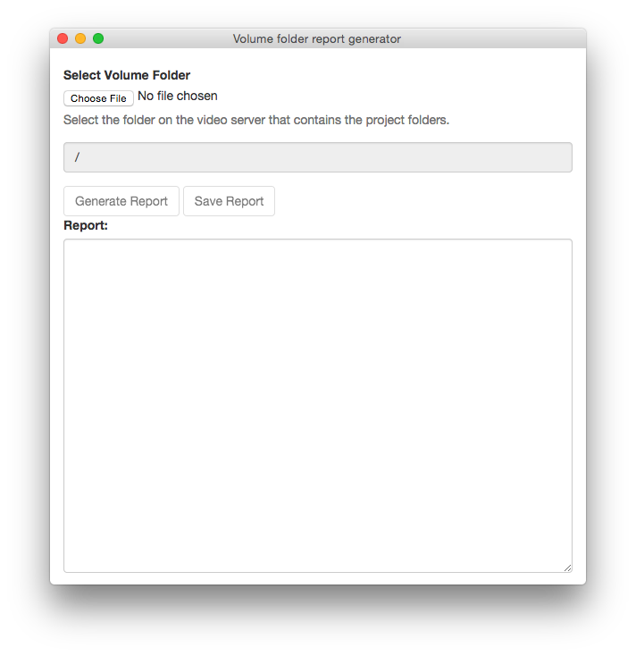
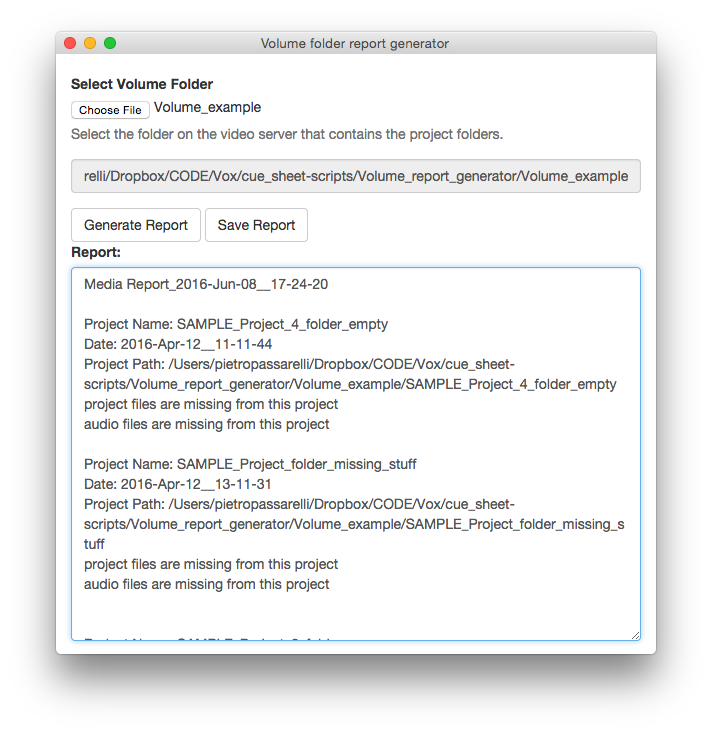

# Volume Report Generator

## Overview

Video teams save projects on a server inside a `volume` folder organised in the following way.
See `Volume_example` for a more comprehensive example folder structure.

(The `.mp3`, `.wavs` and `.prproj` files in the example folder are not valid files, they just have those extensions)

```
└── Volume
       ├── SAMPLE_Project_1_folder
       |   ├── ASSETS
       │   ├── EXPORTS
       │   ├── MEDIA
       │   └── PROJECTS
       └── SAMPLE_Project_1_folder
             ├── ASSETS
             ├── EXPORTS
             ├── MEDIA
             └── PROJECTS
```

When making a cue sheet (a document that declares what music is being used in a video for legal purposes) a lot of time is spent going through the folders on the server to figure out if there are project files or audio files missing.


This app allows the user to set the path to the volume folder and generates a report on the desktop.





Example of the `.txt` report.

```
Media Report_2016-Jun-03__11-21-26


Project Name: EAT
Date: 2016-Jun-02__11-11-41
Project Path: /Volumes/MASTERS3/TEST/EAT

Project files:
/Volumes/MASTERS3/TEST/EAT/PROJECTS/Dorilocos.prproj

Audio files:
/Volumes/MASTERS3/TEST/EAT/ASSETS/KPM_KPM_0862_10101_Whipped_Cream_b_60_APM.mp3


Project Name: VRG
Date: 2016-Jun-02__11-11-50
Project Path: /Volumes/MASTERS3/TEST/VRG

Project files:
/Volumes/MASTERS3/TEST/VRG/PROJECTS/VRG_VHO_459_Fitbit_Alta.prproj

Audio files:
/Volumes/MASTERS3/TEST/VRG/ASSETS/DED_DED_0108_00101_High_Voltage_APM.mp3
```


## Implementation overview

[NWSJ](https://github.com/nwjs/nw.js) has been used for the GUI. It triggers the ruby script and displays stdout.

`main.rb` contains the abstract classes and business logic for traversing the folders instantiating and generating the report.

## Deployment

Use deploy script

```
node deploy.js
```

This creates a build folder inside the repo. The build folder is also in `.gitignore` to avoid accidentally pushing it to remote.

## Usage

To download a ready packaged release, see [release section](https://github.com/voxmedia/Volume_foder_report_generator/releases/tag/1.0.0).
